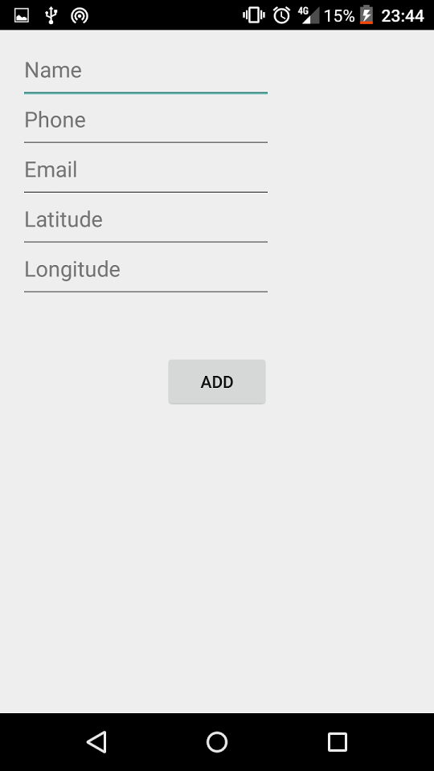

# Contacts PlusPlus

## Authors
* Anis TELLO
* Salla DIAGNE

## Presentation

Contacts PlusPlus is a **basic contacts application**, but has as an added value the geolocalisation. The functionnalities of this application are the following :
* add a contact
* geolocalise an existing contact and visualize an itinerary to the position of this contact
* delete a contact

### Contacts list

When the application opens, the user will see the list of his contacts. The "Add" button enables the user to add a contact to his list.

By clicking the "Nearest" button, the user can see who is his nearest contact.

### Add a contact

The user can add a contact by filling his informations (name, email, phone number) and his geographic coordinates (latitude, longitude).

### Delete a contact

For one reason or another, the user may want to delete a contact from his list. He can do so by clicking the "Delete" button.

### Visualize a contact

The user can visualize a contact.

By clicking on the "Distance" button, the user can see the position of the contacts.

 That position can be viewed in Google Maps after a click on the "Map" button.

 

  If the user wants to meet this contact, a simple click on the "Itinerary" button generates an itinerary between the user's position and the contact's position.
